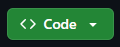

# MinhaLoja - E-commerce em Django

Este é um projeto de e-commerce desenvolvido em Django. Ele permite que os usuários visualizem produtos, façam compras e gerenciem seus pedidos.

## Pré-requisitos

Antes de começar, você precisará de algumas dependências:

- [Python](https://www.python.org/downloads/) 3.x
- [Git](https://git-scm.com/) (opcional, para clonar o repositório)

## Como rodar o projeto localmente

Siga os passos abaixo para rodar o projeto em seu ambiente local,Rode esses comandos(Powershell):

**Clone este Repositorio**

git clone https://github.com/LuisCampelo2/MinhaLoja
cd MinhaLoja

Ou cole esse link https://github.com/LuisCampelo2/MinhaLoja no navegador e clique neste botao 

**Crie um ambiente virtual python (opcional,porém recomendado)**

python -m venv venv

**Ative seu ambinete virtual**

source venv/bin/activate  # no Windows use venv\Scripts\activate

**Instale as dependências**

pip install -r requirements.txt

**Mude o nome do arquivo .env-example para .env e preencha as informções**

mv .env-example .env

**Rode o servidor**

python manage.py runserver

**Acesse o projeto clicando nesse endereço que irá aparecer no terminal:**
http://127.0.0.1:8000

